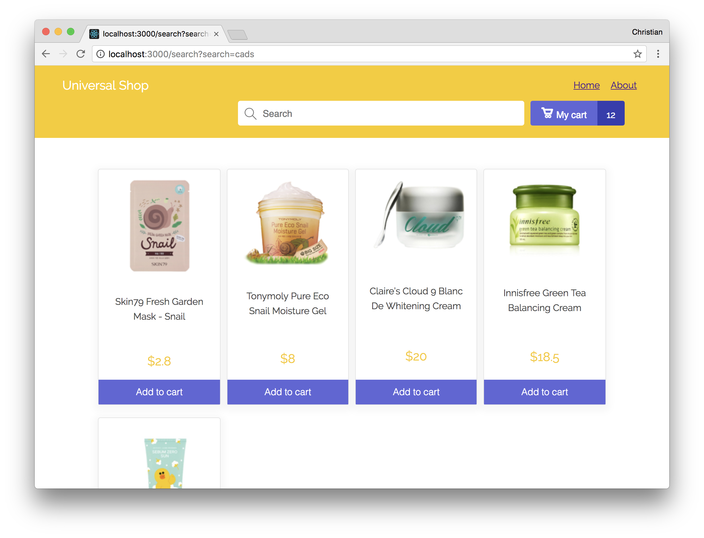

# Universal Landing 



This project is used as an example for Chapter 5 & 6 in the [Hands On Next.js](https://honext.io) book.

## Getting Started
-   Clone the repository

-   Install the dependencies 

```bash
npm install
```

- Start the application

```bash
npm run dev
```